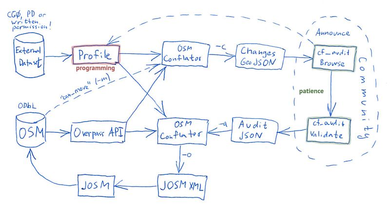

% Atelier import donnée opendata
% Groupe local OSM Grenoble - Jérôme Villafruela
% 08/04/2019

# Opendata de La Métro

Site : http://data.metropolegrenoble.fr/

Analyse : https://wiki.openstreetmap.org/wiki/Grenoble_groupe_local/import_metropole-grenoble

Fichiers considérés

- arceaux à vélo : pas importés
- arbres : importés par Vincent Frison 
- parcmètres : importés (02/2019)
- Points d'apport volontaire 

# Démarche 

- Pas d'import "sauvage"
- Annoncer vos intentions
- Discuter avec la communauté
- Documenter vos imports
- https://wiki.openstreetmap.org/wiki/FR:Code_de_conduite_des_modifications_automatis%C3%A9es 
- https://wiki.openstreetmap.org/wiki/Category:FR:Politique_d%27importation


# Conflation

Dans les SIG, la conflation est définie comme le processus qui consiste à combiner l'information géographique provenant de sources qui se chevauchent afin de conserver des données exactes, de minimiser la redondance et de réconcilier les conflits de données. [Longley et al. 2001]

# Outils

## Génériques

- Plugin Josm Conflation
- OSM Conflator
- Osmose

## Spécialisés

- [BatiFusion](https://github.com/jecor/bati-fusion) : Cadastre (Jérôme Cornet)
- [Osmaxil](https://github.com/vince-from-nice/osmaxil) Vincent Frison : arbres, hauteur bâti.

# OSM Conflator

* écrit en Python 3 par maps.me 
* Site : https://github.com/mapsme/osm_conflate
* Doc : https://wiki.openstreetmap.org/wiki/OSM_Conflator
* Install 
````
 pip3 install osm_conflate
 ````



# OSM Conflator - utilisation

## paramétrage

Fichier python pav.py


Exécution

````
conflate pav.py -i data/pav-communes/pav-Claix.tsv -o pav.osm -c preview.json
````

Visualiser le fichier preview.json dans http://geojson.io 

# Atelier

Analyse du fichier PAV de la Métro (pav.tsv)

Utiliser OSM conflator sur les fichiers opendata de la Métro.

https://github.com/JVillafruela/atelier-osm-conflator 

Fichiers dans atelier-osm-conflator/osm-conflator/data/


