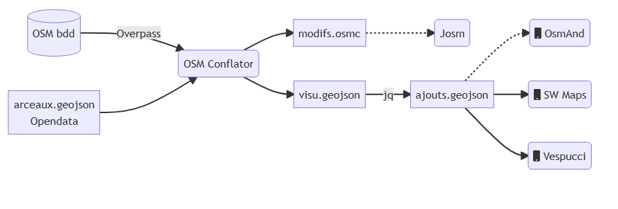

% Atelier import donnée opendata
% Groupe local OSM Grenoble - Jérôme Villafruela
% 21/02/20222


# Objectif

Générer un fichier des arceaux absents d'OSM visualisable sur mobile.


# Opendata de La Métro vs OSM

Opendata : <https://data.metropolegrenoble.fr/ckan/dataset/les-arceaux-a-velo-de-la-metropole-de-grenoble>

OSM : Requête Overpass
```
[out:json][timeout:25];
{{geocodeArea:Grenoble}}->.searchArea; 
(
  node["amenity"="bicycle_parking"] ["bicycle_parking"="stands"](area.searchArea);
);
out body;
>;
out skel qt;
```

## Cardinalité - OSM plus précis


# Workflow



# OSM Conflator

* écrit en Python 3 par maps.me 
* Source : <https://github.com/mapsme/osm_conflate>
* Doc : <https://wiki.openstreetmap.org/wiki/OSM_Conflator>
* Installation 
````bash
python3 -m venv osm-conflator
cd osm-conflator && source bin/activate
#pip3 install osm_conflate
pip3 install -r ./requirements.txt
 ````


# OSM Conflator - utilisation

## paramétrage

Fichier python arceaux.py


## Exécution

````
conflate arceaux.py -i data/Grenoble/Arceaux_EPSG4326.geojson -o arceaux.osm -c visu.geojson
````

Visualiser le fichier visu.json dans <http://geojson.io> 


Filtrer les créations :

```bash
jq '.features |= map(select(.properties.action == "create"))' visu.geojson >arceaux-create.geojson
``` 

Filtrer les modifications :

```bash
jq '.features |= map(select(.properties.action == "modify"))' visu.geojson >arceaux-modify.geojson
``` 


# Atelier

<https://github.com/JVillafruela/atelier-osm-conflator> 

Fichiers dans atelier-osm-conflator/osm-conflator/data/


